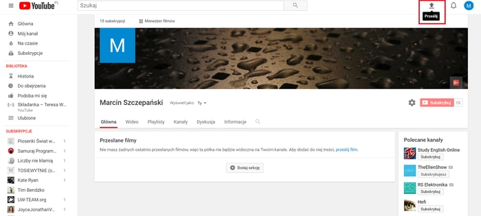
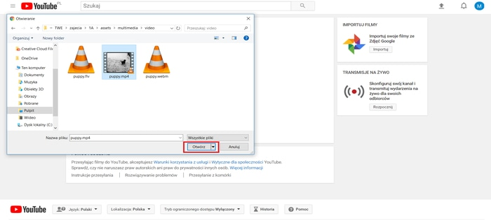
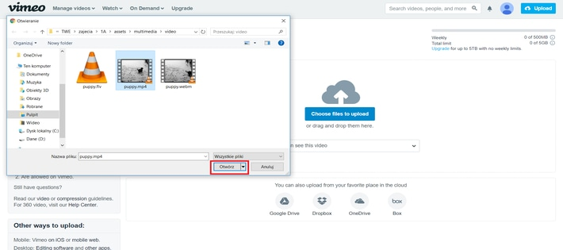
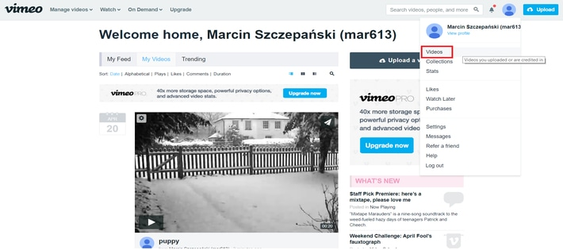
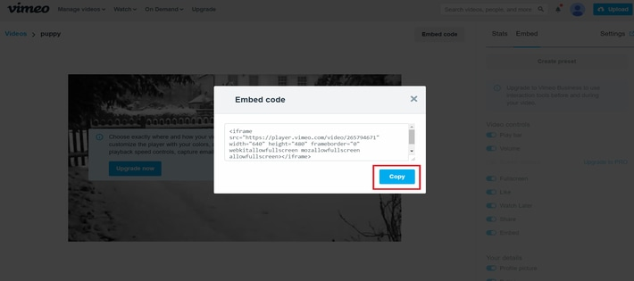

	<h1 id="main1">[ZALICZENIE ZADANIA - MULTIMEDIA]</h1>
	 
	<h1 id="main1">Wideo na WWW</h1>
    
Materiały dodatkowe do&nbsp;warsztatów technologii webowych prowadzonych na Wydziale Matematyki i&nbsp;Informatyki Uniwersytetu im. Adama Mickiewicza w Poznaniu.

	<a href="../../index.html" class="button-v button-module">Wróć do&nbsp;spisu materiałów</a>
	

## 1. Wprowadzenie

W tej lekcji będziemy omawiać jak osadza się pliki wideo na stronach internetowych dla HTML5.
Przypomnijmy zatem podstawową budowę takiego dokumentu:

### Przykład 1.1.

  
Pełną dokumentację języka HTML5, omówienie wszystkich znaczników znajdziesz na&nbsp;stronie <a href="https://www.w3schools.com/html/" target="blank">HTML5 Tutorial</a>.

### 1.1. Przedstawienie formatów i odtwarzaczy klipów wideo

Aby umieścić klip wideo na własnej stronie internetowej, trzeba zrozumieć zagadnienia związane z&nbsp;formatami plików
oraz&nbsp;odtwarzaczami (wtyczkami) wideo.

#### 1.1.1. Formaty

Filmy są dostępne w&nbsp;wielu formatach (np. Blu-ray czy DVD).
W&nbsp;świecie komputerów i&nbsp;internetu formatów wideo jest jeszcze więcej
(np. AVI, MPEG, WebM, Windows Media, FLV, H264).
Odtwarzacz DVD nie odtworzy kasety VHS - analogicznie poszczególne
przeglądarki różnią się pod&nbsp;względem obsługiwanych formatów wideo.
Aby&nbsp;użytkownicy strony byli w&nbsp;stanie obejrzeć na&nbsp;niej
klip wideo, być może będziemy musieli go zapisać w&nbsp;innym formacie.
Taki proces konwertowania klipu wideo z&nbsp;jednego formatu na&nbsp;drugi
jest czasami nazywany **kodowaniem**.
W&nbsp;Internecie dostępnych jest kilka aplikacji służących do&nbsp;kodowania
wideo (np. Micro Video Converter).

#### 1.1.2. Odtwarzacze i wtyczki

Pierwsze przeglądarki były projektowane tak, by&nbsp;wyświetlać wyłącznie
teksty i&nbsp;obrazy. Z&nbsp;tego powodu przeglądarki tworzone przed&nbsp;2010
rokiem, by odtwarzać klipy wideo, zazwyczaj wymagały użycia dodatkowych
programów nazywanych **odtwarzaczami** lub&nbsp;**wtyczkami**.
Te dodatkowe programy odtwarzały jedynie wybrane formaty wideo.
Nowsze przeglądarki zostały rozbudowane i&nbsp;obsługują element
&lt;video&gt; wprowadzony w&nbsp;HTML5
(który sprawia, że&nbsp;dodatkowe odtwarzacze i&nbsp;wtyczki są zbyteczne).
Niestety (jeszcze) czasami niektórzy użytkownicy nie dysponują przeglądarkami, które
obsługują ten element. Przeglądarki, które to potrafią, wymagają, by&nbsp;materiał
wideo był kodowany w&nbsp;innych formatach.

#### 1.1.3. Rozwiązanie

Najprostszym sposobem umieszczenia materiału wideo na&nbsp;własnej stronie
jest skorzystanie z&nbsp;usługi udostępniającej klipy
takiej jak **YouTube** czy **Vimeo**.
Zdarzają się jednak sytuacje, w&nbsp;których takie rozwiązanie jest
nieodpowiednie (o&nbsp;czym mowa będzie później) i&nbsp;trzeba umieścić klipy wideo
we&nbsp;własnej witrynie.

## 2. Jak to się robiło kiedyś? - czyli słów kilka o&nbsp;filmach Flash Video

Aktualnie już nie używa się tej technologii i&nbsp;poniżej przedstawiony sposób osadzania
plików FLV na&nbsp;stronie na&nbsp;najnowszych przeglądarkach już nie jest wspierany.

### 2.1. Czym jest Flash Video?

W dużym skrócie **Flash** to wtyczka do&nbsp;przeglądarek internetowych od&nbsp;Adobe, która&nbsp;umożliwia wyświetlanie określonych typów zawartości.
Jej instalacja jest niezbędna, by&nbsp;odtwarzać reklamy i&nbsp;treści multimedialne wykonane przy&nbsp;wykonaniu tej technologii.
Wtyczka Flash przez wiele lat była uważana za&nbsp;niezbędne wyposażenie każdej przeglądarki internetowej.
Na&nbsp;przestrzeni lat jej znaczenie zaczęło maleć i&nbsp;rośnie liczba stron porzucających Flasha na&nbsp;rzecz innych technologii, takich jak HTML5.

Natomiast **Flash Video** jest kontenerem multimedialnym używanym do&nbsp;dystrybucji plików wideo w&nbsp;Internecie.
Pliki Flash Video mają rozszerzenie **.flv**.

### 2.2. Przygotowanie materiałów i&nbsp;odtwarzaczy przy&nbsp;użyciu Flash Video

Aby prezentować materiały wideo na&nbsp;własnej stronie przy&nbsp;użyciu Flash Video, należy wykonać **trzy** operacje.

#### 2.2.1. Konwersja materiału wideo do&nbsp;formatu FLV

Aby skorzystać z&nbsp;Flash Video, trzeba skonwertować posiadany materiał do&nbsp;formatu FLV.
Począwszy od&nbsp;wersji 6, środowisko Flash zawiera narzędzie **Flash Video Converter** umożliwiające
konwersję materiału wideo do&nbsp;formatu FLV.
Niektóre odtwarzacze Flash obsługują także format H264 (a&nbsp;niektóre programy do&nbsp;edycji
wideo umożliwiają zapisywanie materiału w&nbsp;tym formacie).
Inne programy umożliwiające konwersję materiału do&nbsp;tych dwóch formatów można znaleźć
po&nbsp;wpisaniu w&nbsp;wyszukiwarce hasła "FLV or H264 converters".

#### 2.2.2. Wybór odtwarzacza plików FLV

Do odtwarzania filmów FLV potrzebny będzie odtwarzacz napisany w&nbsp;technologii Flash.
Służy on do&nbsp;odtwarzania filmu oraz&nbsp;udostępnia elementy sterujące, takie jak
przyciski do&nbsp;odtwarzania i&nbsp;zatrzymywania filmu. 
Takie odtwarzacze można znaleźć na&nbsp;stronach takich jak jwplayer.com.
Korzystanie z&nbsp;takich odtwarzaczy nie&nbsp;wymaga kupowania środowiska Flash.

#### 2.2.3. Umieszczenie odtwarzacza i&nbsp;materiału wideo na&nbsp;stronie

Odtwarzacz można umieścić na&nbsp;stronie przy użyciu technik wykorzystujących skrypty JavaScript,
takich jak&nbsp;SWFObject.

Do odtwarzacza należy przekazać informację o lokalizacji klipu wideo, który ma być prezentowany.

**Czym jest SWFObject?**

SWFObject jest to skrypt, który można pobrać bezpłatnie z&nbsp;witryny Google.
Skrypt ten sprawdza, czy&nbsp;przeglądarka użytkownika może wyświetlać filmy Flash.

Poniżej znajduje się krótki przykład umieszczania filmu flash na&nbsp;stronie WWW:

### Przykład 2.1.

## 3. Osadzanie plików wideo na stronie w HTML5

Aktualnie na&nbsp;stronach internetowych coraz częściej są umieszczane filmy. 
Wcześniej często używano technologii Flash, obecnie wykorzystywane są częściej inne wtyczki umożliwiające wyświetlanie odtwarzacza na&nbsp;WWW. 
Niestety większość wtyczek jest płatna, natomiast inne są&nbsp;zbyt ciężkie w&nbsp;obsłudze. 
Bardzo często na&nbsp;WWW można spotkać również odtwarzacz z&nbsp;serwisu YouTube. 
Twórcy specyfikacji HTML5 dostrzegli lukę i&nbsp;dodali do&nbsp;standardu elementy umożliwiające wyświetlenie 
Takie rozwiązanie pozwala wyświetlać filmy w&nbsp;jednym z&nbsp;obsługiwanych formatów, 
nie&nbsp;obciążając sprzętu wtyczkami, które "pożerają" zasoby naszego komputera.

### 3.1. Znacznik &lt;video&gt;

Aby&nbsp;umieścić klip wideo na&nbsp;stronie WWW można posłużyć się elementem &lt;video&gt;. 
Między znacznikami tego elementu można umieścić elementy określające lokalizację pliku wideo, 
plik tekstowy oraz&nbsp;alternatywny tekst, który&nbsp;zostanie wyświetlony, jeśli przeglądarka użytkownika nie&nbsp;będzie obsługiwać wideo.

Otwierający znacznik elementu &lt;video&gt; może zawierać różne atrybuty, które&nbsp;pozwolą na&nbsp;określenie, 
jak ma się zachować oraz&nbsp;wyglądać nasz odtwarzacz. 

W&nbsp;poniższym przykładzie użyto atrybutów width oraz&nbsp;height, 
które pozwalają nam określić (w&nbsp;pikselach) odpowiednio szerokość i&nbsp;wysokość odtwarzacza.
Dzięki temu podczas ładowania strony przeglądarka od&nbsp;razu przygotowuje przestrzeń dla&nbsp;naszego odtwarzacza.

Dzięki atrybutowi controls w&nbsp;odtwarzaczu zostanie dodany pasek,
który&nbsp;pozwala użytkownikowi wznowić oraz zatrzymać odtwarzanie klipu, daje opcję
tzw.&nbsp;__fullscreen-a__, czyli wyświetlenia filmu na&nbsp;całym ekranie oraz&nbsp;regulację głośności.

### Przykład 3.1.

### 3.2. Atrybuty odtwarzacza

Atrybuty elementu &lt;video&gt; umożliwiają nam precyzyjnie określić parametry odtwarzacza oraz&nbsp;jego funkcjonalności.

Spis atrybutów jest dostępny poniżej:

- src - określa lokalizację pliku wideo (wartością jest adres URL);
- width - ustala szerokość odtwarzacza w&nbsp;pikselach;
- height - ustala wysokość odtwarzacza w&nbsp;pikselach;
- controls - wyświetla pasek sterowania odtwarzaniem wideo;
- loop - pozwala na&nbsp;odtwarzanie w&nbsp;pętli;
- muted - wycisza audio na&nbsp;początku;
- poster - określa lokalizację grafiki, która jest wyświetlana przed&nbsp;rozpoczęciem odtwarzania (wartością jest adres URL);
- preload - ustala jak przeglądarka powinna ładować film (wartości: 
<a target="blank" href="http://webkod.pl/kurs-html/tagi/zawartosc-osadzona/element-video#preload-none">none</a>, 
<a target="blank" href="http://webkod.pl/kurs-html/tagi/zawartosc-osadzona/element-video#preload-auto">auto</a>, 
<a target="blank" href="http://webkod.pl/kurs-html/tagi/zawartosc-osadzona/element-video#preload-metadata">metadata</a>);
- autoplay - automatycznie odtwarza film po&nbsp;załadowaniu.

### Ćwiczenie 3.1.

Zmodyfikuj kod źródłowy z przykładu 3.1. tak, aby wideo odtwarzało się w pętli zaraz po&nbsp;załadowaniu.
Całe wideo powinno zostać wczytywane od&nbsp;razu.

<a class="button-v button-module button-task" style="cursor: pointer;">Pokaż rozwiązanie</a>

	<a class="button-v button-module button-solution" style="cursor: pointer;">Ukryj rozwiązanie</a>
	

### 3.3. Wybór pliku źródłowego

Źródło pliku wideo możemy podać w&nbsp;inny sposób - umożliwia on podanie informacji o alternatywnym pliku,
który zostanie wyświetlony w&nbsp;przypadku problemów z&nbsp;pierwszym podanym.

Element source określa lokalizację pliku wideo do&nbsp;wyświetlenia.
Aby&nbsp;określić ścieżkę dostępu do&nbsp;filmu służy atrybut src tego elementu.
Natomiast w&nbsp;atrybucie type elementu source określa się **identyfikator** formatu klipu wideo.

W&nbsp;elemencie video możemy umieszczać więcej elementów source.
Jeśli przeglądarka użytkownika nie&nbsp;będzie mogła rozpoznać i&nbsp;odtworzyć wideo z&nbsp;pierwszej podanej lokalizacji,
będzie sprawdzać kolejne, które&nbsp;są&nbsp;zakodowane w&nbsp;innych formatach.

Element source ma także atrybut type.
W tym atrybucie, określamy identyfikator formatu wideo pliku wskazanego w&nbsp;atrybucie src tego elementu.
Aktualnie można wyświetlić w&nbsp;przeglądarce trzy formaty wideo: MP4, Ogg i&nbsp;WebM.
Wartością atrybutu type jest jeden z&nbsp;typów MIME:

- video/mp4 - format MP4 z&nbsp;kodekiem wideo H.264 i&nbsp;kodekiem audio AAC;
- video/ogg - format Ogg z&nbsp;kodekiem wideo Theora i&nbsp;kodekiem audio Vorbis;
- video/webm - format WebM z&nbsp;kodekiem wideo VP8 i&nbsp;kodekiem audio Vorbis.

### Przykład 3.2.

## 4. Wybrane serwisy poświęcone udostępnianiu plików wideo

Najprostszym sposobem prezentowania klipów wideo na&nbsp;własnych stronach
jest przesłanie ich do&nbsp;takiej witryny jak YouTube, Dailymotion lub&nbsp;Vimeo
i&nbsp;skorzystanie z&nbsp;udostępnianych przez&nbsp;nie&nbsp;mechanizmów
przy&nbsp;osadzaniu wideo na&nbsp;własnej stronie.

### 4.1. YouTube

YouTube jest powszechnie znanym i&nbsp;popularnym serwisem, w&nbsp;którym możemy **bezpłatnie** przechowywać klipy wideo i&nbsp;udostępniać je.
Pozwala również na&nbsp;osadzanie filmów na&nbsp;własnych stronach WWW z&nbsp;serwerów serwisu.
Minusem jest to, że&nbsp;serwis nakłada reklamy na&nbsp;nasz klip.
Jednak możliwości tego serwisu są większe - możemy między innymi tworzyć własne kanały (i&nbsp;zarabiać na&nbsp;nich).
YouTube jest dostępny w&nbsp;wielu wersjach językowych - w&nbsp;tym po polsku.

### Ćwiczenie 4.1.1.

Wejdź na stronę serwisu <a href="https://www.youtube.com/?gl=PL&hl=pl" target="blank">YouTube</a> i&nbsp;zapoznaj się z&nbsp;interfejsem tego serwisu.

### Ćwiczenie 4.1.2.

Zaloguj się w&nbsp;serwisie <a href="https://www.youtube.com/?gl=PL&hl=pl" target="blank">YouTube</a> poprzez&nbsp;konto Google.
Jeśli nie masz takiego konta - załóż je wcześniej.

#### Jak umieścić klip wideo w&nbsp;serwisie YouTube?

Aby&nbsp;umieścić klip wideo w&nbsp; serwisie YouTube należy wykonać poniższe kroki:

#### 1. Klikamy na przycisk "Prześlij":

#### 2. Wybieramy odpowiedni poziom prywatności filmu:

#### 3. Wybierz plik do przesłania:

#### 4. Pojawia się widok przesyłu pliku - tutaj można podać różne informacje o filmie:

#### 5. Kiedy uzupełnimy odpowiednie informacje i&nbsp;plik zostanie przesłany należy opublikować wideo:

#### 6.1. Po publikacji otrzymujemy bezpośredni link do&nbsp;naszego klipu wideo:

#### 6.2. Po wejściu na wskazany adres widzimy nasz film:

#### 7.1. Możemy też uzyskać kod HTML, który po&nbsp;umieszczeniu w&nbsp;kodzie strony osadzi nam nasz klip wideo:

#### 7.2. Klikając "Pokaż więcej" uzyskamy możliwość manipulowania naszą ramką z&nbsp;filmem, który chcemy osadzić na&nbsp;naszej stronie WWW:

#### 8. Aby edytować przesłany plik należy wejść do studia twórców:

#### 9.1. Aby usunąć plik wideo (w studiu twórców) zaznaczamy nasz film, klikamy przycisk "Działania" a&nbsp;następnie "Usuń".

#### 9.2. Potwierdzamy usunięcie pliku:

#### 9.3. Otrzymujemy informację o&nbsp;usunięciu filmu:

### 4.2. Dailymotion

Wg&nbsp;Wikipedii Dailymotion to serwis internetowy umożliwiający prezentację filmów,
wideoklipów lub&nbsp;własnych mini-produkcji w&nbsp;Internecie, reklamujący się&nbsp;hasłem 
Regarder, publier, partager, założony w&nbsp;Paryżu we&nbsp;Francji, jako odpowiedź na&nbsp;serwis YouTube.
Serwis ten jest w języku angielskim.

### Ćwiczenie 4.2.1.

Wejdź na stronę serwisu <a href="https://www.dailymotion.com/us" target="blank">Dailymotion</a> i&nbsp;zapoznaj się z&nbsp;interfejsem tego serwisu.

### Ćwiczenie 4.2.2.

Zaloguj się w&nbsp;serwisie <a href="https://www.dailymotion.com/us" target="blank">Dailymotion</a>.

#### Jak umieścić klip wideo w&nbsp;serwisie Dailymotion?

Aby&nbsp;umieścić klip wideo w&nbsp; serwisie Dailymotion należy wykonać poniższe kroki:

#### 1. Klikamy na "Settings":

#### 2. W panelu użytkownika wybieramy opcję "Upload":

#### 3. Klikamy "Upload":

#### 4. Wybieramy "Select video files":

#### 5. Wybieramy plik wideo:

#### 6. Czekamy aż plik się załaduje do&nbsp;końca:

#### 7. Klikamy na "Edit and publish":

#### 8. Nasz klip wideo będzie dostępny na&nbsp;naszym profilu:

#### 9. Po kliknięciu w wideo pokaże się nam nasz klip z&nbsp;możliwością edycji:

#### 10. Kiedy wybierzemy opcję "Edit video" zostaniemy przekierowani do&nbsp;panelu edycji:

#### 11.1. Jeśli zejdziemy trochę w&nbsp;dół ukaże nam się opcja pozwalająca na&nbsp;usunięcie klipu - "Delete":

#### 11.2. Potwierdzamy usunięcie poprzez kliknięcie przycisku "Confirm":

#### 11.3. Na stronie naszego kanału nie ma już klipu wideo:

### 4.3. Vimeo

Wikipedia podaje, że&nbsp;Vimeo to serwis internetowy umożliwiający oglądanie 
i&nbsp;udostępnianie plików filmowych przez użytkowników. Strona została założona 
w&nbsp;listopadzie 2004 przez Zacha Kleina oraz&nbsp;Jakoba Lodwicka, który&nbsp;również wymyślił nazwę, 
jest ona grą na słowie video poprzez wplecenie w&nbsp;nazwę słowa me (z&nbsp;ang.&nbsp;ja), 
jako odniesienie do&nbsp;udostępniania plików stworzonych wyłącznie przez&nbsp;użytkowników. 
Serwis został kupiony przez&nbsp;InterActiveCorp w&nbsp;sierpniu 2006 roku.

Regulamin serwisu **zabrania przesyłania plików komercyjnych** (dopuszczalne z&nbsp;płatnego konta PRO), 
wideo z&nbsp;gier, pornografii lub&nbsp;jakiegokolwiek pliku nieutworzonego przez&nbsp;użytkownika. 
Serwis wyróżnia się&nbsp;praktycznym brakiem filmów amatorskich, nieprzygotowanych. 
Spowodowane jest to głównie ograniczeniami wprowadzonymi na&nbsp;użytkowników.

### Ćwiczenie 4.3.1.

Wejdź na stronę serwisu <a href="https://vimeo.com/" target="blank">Vimeo</a> i&nbsp;zapoznaj się z&nbsp;interfejsem tego serwisu.

### Ćwiczenie 4.3.2.

Zaloguj się w&nbsp;serwisie <a href="https://vimeo.com/" target="blank">Vimeo</a>.

#### Jak umieścić klip wideo w&nbsp;serwisie Vimeo?

Aby&nbsp;umieścić klip wideo w&nbsp; serwisie Vimeo należy wykonać poniższe kroki:

#### 1. Klikamy na przycisk "Upload":

#### 2. Ustawiamy poziom prywatności filmu:

#### 3. Następnie klikamy na&nbsp;przycisk "Choose files to upload":

#### 4. Wybieramy plik wideo:

#### 5. Czekamy aż plik się załaduje - w&nbsp;tym czasie ustawiamy podstawowe informacje o&nbsp;filmie:

#### 6. Następnie klikamy przycisk "Save":

#### 7. Na naszym koncie od teraz jest dostępny nasz klip:

#### 8.1. Aby edytować wideo klikamy na "Videos":

#### 8.2. Następnie wybieramy "Settings":

#### 8.3. W zakładce "Basics" możemy ustawić podstawowe informacje takie jak np.&nbsp;tytuł czy&nbsp;opis:

#### 9.1. Po wybraniu zakładki "Embed" mamy dostęp do&nbsp;kodu HTML, który&nbsp;który możemy umieścić w&nbsp;kodzie naszej strony, aby&nbsp;osadzić na&nbsp;niej wideo:

#### 9.2. Po kliknięciu na "Embed code" klikamy przycisk "Copy" - w&nbsp;tym momencie w&nbsp;schowku mamy kod HTML do&nbsp;osadzenia:

#### 10.1. W zakładce "Basics" po zjechaniu na&nbsp;sam dół mamy opcję usunięcia pliku wideo:

#### 10.2. Klikamy na&nbsp;przycisk "Delete this video":

#### 10.3. Wpisujemy hasło do&nbsp;naszego konta a&nbsp;następnie przycisk "Confirm":

#### 10.4. Od teraz naszego filmu nie ma w&nbsp;Vimeo:

## 5. Podsumowanie

Witryny umożliwiające prezentowanie klipów wideo udostępniają odtwarzacze działające w&nbsp;większości przeglądarek.
Korzystając z nich, nie trzeba się przejmować kodowaniem materiału wideo, gdyż&nbsp;pozwalają one na&nbsp;przesyłanie
filmów zapisanych w&nbsp;wielu różnych formatach. 
Po&nbsp;przesłaniu materiału wideo usługi te automatycznie go konwerują do&nbsp;różnych formatów
wymaganych przez&nbsp;poszczególne przeglądarki.

Firmy prowadzące serwery WWW często pobierają dodatkowe opłaty, jeśli witryna zużywa dużą szerokość pasma,
a&nbsp;pliki zawierające filmy są duże. Dlatego przechowywanie i&nbsp;udostępnianie klipów wideo na&nbsp;własnej
stronie może generować dodatkowe koszty. Jeśli natomiast umieścimy klipy np.&nbsp;na&nbsp;YouTube, unikniemy
dodatkowych kosztów związanych z&nbsp;używaną szerokością pasma.

Nasze klipy wideo będą umieszczone w&nbsp;witrynie z&nbsp;usługą udostępniającą, a&nbsp;zatem jeśli chcemy, by&nbsp;były
one dostępne wyłącznie na&nbsp;naszej stronie, konieczne będzie umieszczenie materiału wideo na&nbsp;własnym serwerze i&nbsp;dodanie
do&nbsp;niej odpowiedniego odtwarzacza.

Niektóre witryny nakładają ograniczenia na&nbsp;dopuszczalną treść klipów wideo.
Większość zabrania umieszczania w&nbsp;klipach materiałów reklamowych (co&nbsp;uniemożliwia czerpanie z&nbsp;nich korzyści finansowych).
Część witryn z&nbsp;usługami udostępniania wideo będzie odtwarzać własne reklamy przed&nbsp;rozpoczęciem naszego klipu,
a&nbsp;nawet nakładać je na&nbsp;film podczas jego odtwarzania.
Oprócz tego jakość klipów wideo oferowana przez&nbsp;takie usługi może być niska.

Jeśli chcemy przechowywać materiały wideo na&nbsp;własnym serwerze - a&nbsp;nie&nbsp;korzystać z&nbsp;usługi udostępniającej - to&nbsp;odpowiednie
przygotowanie witryny, takie aby&nbsp;mogła je&nbsp;odtwarzać, będzie od&nbsp;nas wymagało znacznie więcej pracy.

## Źródła
* webkod.pl;
* w3schools.com;
* kurshtml.edu.pl;
* e-zoner.pl;
* youtube.com;
* dailymotion.com;
* vimeo.com;
* wikipedia.com
