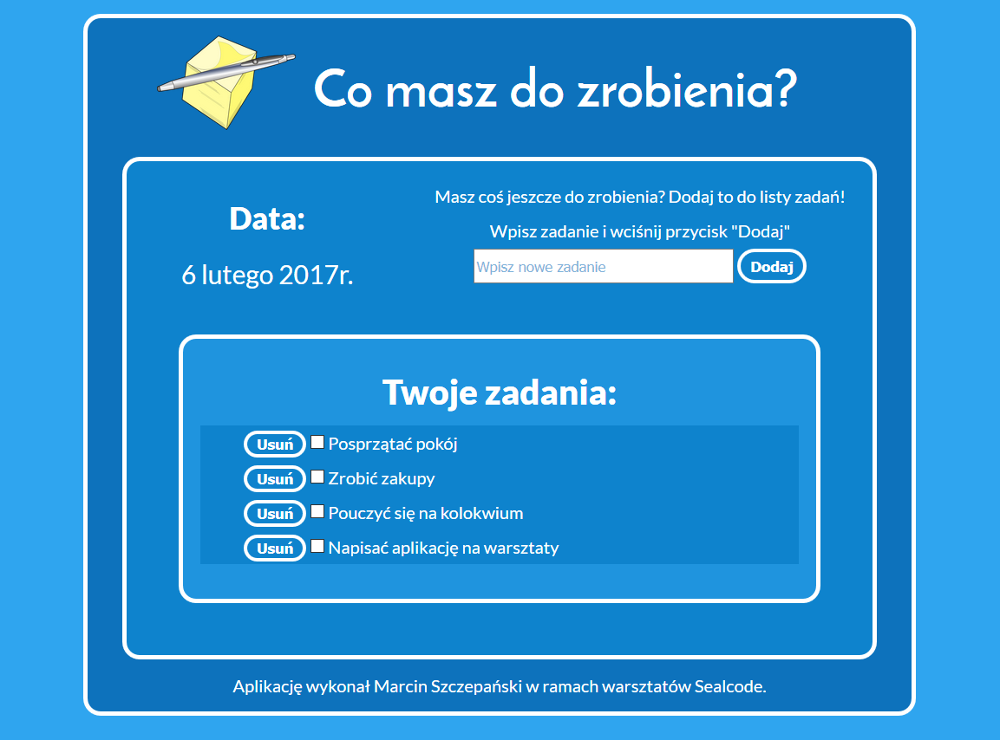

	<h1 id="main1">Informacje wstępne dla modułu 1B</h1>
    <h2 id="main2">Materiały do&nbsp;warsztatów technologii webowych prowadzonych na Wydziale Matematyki i Informatyki Uniwersytetu im. Adama Mickiewicza w Poznaniu.</h2>
	<a href="../../index.html" class="button-v button-module">Wróc do&nbsp;spisu materiałów</a>
	

### Zagadnienia poruszane w trakcie warsztatów:

*   znaczniki charakterystyczne dla języka HTML5;
*   animacje w CSS3;
*   pozycjonowanie elementów na stronie;
*   rytm pionowy;
*	wprowadzenie do Flexboxa;
*	podstawy programowania w języku JavaScript;
*	obiektowy model dokumentu;
*	zdarzenia w JS;
*	REST API.

### Projekt:

W tym semestrze będziemy tworzyć aplikację **"to-do"**, czyli aplikację do zarządzania zadaniami.
Projekt ten będziemy wykonywać w **pięciu** etapach:

- **stworzenie repozytorium, w którym będą się znajdować pliki projektu**;
- **zbudowanie szkieletu aplikacji w HTML5** - dokument powinien zawierać:
	- tytuł aplikacji;
	- aktualną datę (na razie wpisujemy na sztywno - np. "6. lutego 2017r.");
	- pole do wpisania treści nowego zadania;
	- przycisk do dodawania nowego zadania;
	- miejsce na listę zadań (na początku na sztywno wpisujemy kilka zadań);
	- pole typu checkbox do zaznaczenia czy dane zadanie zostało wykonane (domyślnie zadanie jest niewykonane);
	- przycisk do usuwania zadania przy każdym z nich;
	- stopkę;
- **ostylowanie szkieletu aplikacji w CSS3**;
- **"ożywienie" aplikacji przy pomocy języka JavaScript**:
	- po wpisaniu zadania i wciśnięciu klawisza ENTER lub kliknięciu przycisku do dodawania zadanie powinno zostać dodane do listy zadań;
	- pilnujemy aby nie było możliwości dodania pustego zadania;
	- możemy zmieniać status zadania z niewykonanego na wykonane i odwrotnie;
	- po kliknięciu przycisku do usuwania, dane zadanie powinno zniknąć z listy zadań;
	- data powinna być aktualizowana;
- **wysłanie zadań na serwer**:
	- aplikacja powinna łączyć się z serwerem;
	- dodanie, usunięcie i modyfikacja stanu wykonania zadań powinny odbywać się na serwerze;
	- przy odświeżaniu strony oraz dokonaniu zmian(y), lista zadań widoczna na stronie powinna zostać zaktualizowana.

Terminy wykonania poszczególnych części projektu będą podawane na bieżąco w czasie trwania zajęć.

Każdy uczestnik, który będzie **aktywnie uczestniczyć** w warsztatach otrzyma na końcu imienny **certyfikat** :)

### Co to znaczy "aktywnie uczestniczyć" w warsztatach?

Aktywnie uczestniczyć w warsztatach oznacza, że uczestnik:

*	był na co najmniej połowie warsztatów;
*	wykonał większość zadań domowych;
*	przystąpił do wykonania projektu i pomyślnie przeszedł przez co najmniej 4 z 5 etapów tego projektu.

### Przykładowy wygląd aplikacji:
