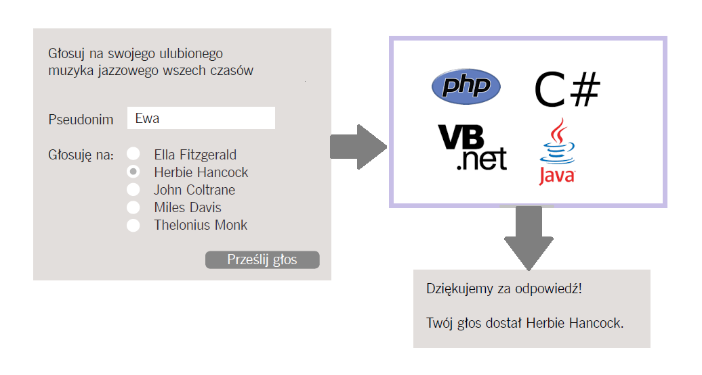
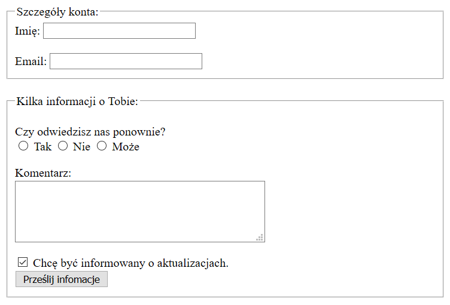

<div class="inner">
	<h1 id="main1">Zajęcia 1</h1>
    <div id="main2" class="h2">Materiały do&nbsp;warsztatów technologii webowych prowadzonych na Wydziale Matematyki i&nbsp;Informatyki Uniwersytetu im. Adama Mickiewicza w Poznaniu.</div>
	<a href="../../index.html" class="button-v button-module">Wróć do&nbsp;spisu materiałów</a>
	<a href="https://jsfiddle.net/" target="blank" class="button-v button-module">Tu będziemy testować kod&nbsp;źródłowy</a>
	<div style="clear: both;"></div>
</div>

## 1. Nowości w HTML5
W języku HTML5 został wprowadzony zbiór nowych elementów służących do oznaczania fragmentów tworzonych stron. Nazwy tych elementów określają rodzaj zawartości, jaką należy w nich umieszczać.

### 1.1. Nagłówki i stopki
Elementy <span class="preformat">&lt;header&gt;</span> i <span class="preformat">&lt;footer&gt;</span> mogą być używane do tworzenia:

* głównego nagłówka i stopki prezentowanych odpowiednio na górze i na dole każdej strony witryny;
* nagłówka i stopki umieszczonych w poszczególnych elementach <span class="preformat">&lt;article&gt;</span> oraz <span class="preformat">&lt;section&gt;</span>.

### 1.2. Nawigacja
Element <span class="preformat">&lt;nav&gt;</span> jest przeznaczony do umieszczania głównych bloków nawigacyjnych witryny, takich jak lista łączy do jej głównych działów.

### Przykład 1.1.

```html
<header>
    <h1>Dania świata</h1>
    <nav>
        <ul>
            <li><a href="">Strona Główna</a></li>
            <li><a href="">Zajęcia</a></li>
            <li><a href="">Catering</a></li>
            <li><a href="">O nas</a></li>
            <li><a href="">Kontakt</a></li>
        </ul>
    </nav>
</header>

<footer>
    &copy; 2017 Dania świata
</footer>
```

### 1.3. Sekcje
Element <span class="preformat">&lt;section&gt;</span> służy do grupowania innych powiązanych ze sobą elementów. Zazwyczaj każda taka sekcja ma własny nagłówek.
Na przykład na stronie głównej naszej witryny możemy umieścić kilka elementów <span class="preformat">&lt;section&gt;</span> zawierających różne sekcje strony, takie jak najnowsze publikacje, najpopularniejsze produkty czy formularze do subskrypcji biuletynu informacyjnego.

### Przykład 1.2.

```html
<section class="popular-recipes">
	<h2>Popularne przepisy</h2>
	<a href="">Grillowany kurczak</a>
	<a href="">Mielone kotleciki z kurczaka</a>
	<a href="">Smażone naleśniki</a>
	<a href="">Gulasz z kurczaka</a>
</section>
```

### 1.4. Grupy nagłówków
Element <span class="preformat">&lt;hgroup&gt;</span> służy do grupowania od jednego do kilku elementów <span class="preformat">&lt;h1&gt; - &lt;h6&gt;</span>, tak by były one traktowane jako jeden nagłówek.

### Przykład 1.3.

```html
<hgroup>
	<h2>Nauka HTML5</h2>
	<h3>Kurs tygodniowy</h3>
</hgroup>
```

### 1.5. Ilustracje
Element <span class="preformat">&lt;figure&gt;</span> może zawierać dowolne treści, do których odwołuje się główna treść artykułu (nie tylko obrazy).
Należy też zauważyć, że artykuł nie powinien tracić znaczenia w przypadku przesunięcia zawartości elementu <span class="preformat">&lt;figure&gt;</span>. Dlatego należy go używać tylko w sytuacjach, kiedy w treści artykułu znajduje się jedynie odwołanie do elementu.
Poniżej przedstawiono kilka zastosowań elementu <span class="preformat">&lt;figure&gt;</span>:

* obrazy,
* klipy wideo,
* wykresy,
* diagramy,
* listingi kodu,
* teksty uzupełniające główną część kodu.

W elemencie <span class="preformat">&lt;figure&gt;</span> należy umieszczać także element <span class="preformat">&lt;figcaption&gt;</span> służący do podania opisu zawartości elementu <span class="preformat">&lt;figure&gt;</span>.

### Przykład 1.4.

```html
<figure>
    
    <figcaption>Git</figcaption>
</figure>
```

### 1.6. Artykuły
Element <span class="preformat">&lt;article&gt;</span> pełni funkcję pojemnika, w którym są umieszczane dowolne sekcje strony, przy czym powinny one być stosunkowo autonomiczne i nadawać się do zebrania w większą grupę.

### Przykład 1.5.

```html
<article>
    <figure>
        
        <figcaption>HTML5</figcaption>
    </figure>
    <hgroup>
        <h2>Nauka HTML5</h2>
        <h3>Kurs tygodniowy</h3>
    </hgroup>
    <p>Tygodniowe zajęcia wprowadzające, przedstawiające znaczniki języka HTML5.</p>
</article>    
<article>
    <figure>
        
        <figcaption>Git</figcaption>
    </figure>
    <hgroup>
        <h2>Kurs Git-a</h2>
        <h3>Zajęcia jednodniowe</h3>
    </hgroup>
    <p>Intensywny, jednodniowy kurs uczący pracy z Git-em.</p>
</article>    
```

### 1.7. Sekcje boczne
Element <span class="preformat">&lt;aside&gt;</span> ma kilka zastosowań, zależnych od tego, czy znajduje się wewnątrz elementu <span class="preformat">&lt;article&gt;</span>, czy poza nim.
W pierwszym przypadku element <span class="preformat">&lt;aside&gt;</span> powinien zawierać informacje powiązane z&nbsp;artykułem, lecz niekoniecznie z jego znaczeniem (np. wyróżniony cudzysłów).
Natomiast w drugiej sytuacji element <span class="preformat">&lt;aside&gt;</span> służy nam jako pojemnik dla treści związanych z całą stroną (np. łącza do innych sekcji witryny).

### Przykład 1.6.

```html
<aside>
	<section class="popular-recipes">
		<h2>Popularne przepisy</h2>
		<a href="">Grillowany kurczak</a>
		<a href="">Mielone kotleciki z kurczaka</a>
		<a href="">Smażone naleśniki</a>
		<a href="">Gulasz z kurczaka</a>
	</section>
	<section class="contact-details">
		<h2>Kontakt</h2>
		<p>Dania świata <br />
			ul. Poznańska 27 <br />
			Poznań
		</p>
	</section>
</aside>
```

### 1.8. Grupowanie elementów w sekcje

### Ćwiczenie 1.1.
Przeanalizuj poniższy kod źródłowy:

```html
<div class="wrapper">
	<header>
		<h1>Dania świata</h1>
		<nav>
			<!-- zawartość paska nawigacyjnego -->
		</nav>
	</header>
	<section class="courses">
		<!-- zawartość sekcji -->
	</section>
	<aside>
		<!-- zawartość paska bocznego -->
	</aside>
	<footer>
		<!-- zawartość stopki -->
	</footer>
</div>
```

Jakie znaczenie w powyższym kodzie ma element <span class="preformat">&lt;div&gt;</span> ?

## 2. Formularze

### Ćwiczenie 2.1.
Co to jest formularz? Zastanów się, jakie znaczenie może mieć pojęcie formularza w kontekście języka HTML5.

### 2.1. Jak działają formularze?
Użytkownik wypełnia formularz, a następnie naciska przycisk, by przesłać podane w nim informacje na serwer. Co się dzieje dalej?

### Ćwiczenie 2.2.
Przeanalizuj a następnie omów poniższy schemat:



### 2.2. Struktura formularzy
Wszystkie pola formularzy są umieszczane wewnątrz elementu <span class="preformat">&lt;form&gt;</span>. W tym elemencie zawsze określamy wartość atrybutu <span class="preformat">action</span>; oprócz tego zazwyczaj podaje się wartości atrybutów <span class="preformat">method</span> oraz <span class="preformat">id</span>.

Każdy element <span class="preformat">&lt;form&gt;</span> wymaga określenia atrybutu <span class="preformat">action</span>. Jest nią adres URL strony na serwerze, do&nbsp;której w momencie wysłania formularza należy przekazać podane w nim informacje.

Formularze można wysyłać za pomocą jednej z dwóch metod: <span class="preformat">get</span> albo <span class="preformat">post</span>.
W przypadku stosowania metody <span class="preformat">get</span> wartości pól formularza są dodawane na końcu adresu URL podanego w atrybucie <span class="preformat">action</span>.
Natomiast w przypadku zastosowania metody <span class="preformat">post</span> wartości są przesyłane w tzw. **nagłówkach HTTP**.
Jeśli&nbsp;atrybut <span class="preformat">method</span> nie zostanie podany, przeglądarka prześle formularz, używając metody <span class="preformat">get</span>.

### Ćwiczenie 2.3.
Jak myślisz, kiedy do przesyłania formularzy używamy metody <span class="preformat">get</span> a kiedy metody <span class="preformat">post</span>?

### Ćwiczenie 2.4.
Kiedy Twoim zdaniem należy w formularzu umieszczać atrybut <span class="preformat">id</span>?

### 2.3. Pola formularzy
W tej części omówimy podstawowe elementy używane przy tworzeniu formularzy.

#### 2.3.1. Pola tekstowe
Element <span class="preformat">&lt;input&gt;</span> służy do tworzenia kilku różnych rodzajów pól. Rodzaj pola, które zostanie utworzone, zależy od wartości atrybutu <span class="preformat">type</span> tego elementu.

Przeanalizujmy poniższy przykład:

### Przykład 2.1.

```html
<form action="http://www.jakaswitryna.com/login.php">
	<p>Nazwa użytkownika:
		<input type="text" name="username" size="15" maxlength="30" />
	</p>  
</form>
```

Jeśli atrybut <span class="preformat">type</span> będzie mieć wartość <span class="preformat">text</span>, zostanie utworzone pole tekstowe.

Kiedy użytkownicy wypełniają formularz serwer musi wiedzieć, jakie informacje zostały podane w&nbsp;poszczególnych polach. Z tego powodu w każdym polu formularza należy podać wartość atrybutu <span class="preformat">name</span>. Identyfikuje ona pole formularza i jest przesyłana wraz z jego zawartością na serwer.

Atrybutu <span class="preformat">maxlength</span> można używać w celu ograniczenia liczby znaków wpisywanych w polu.

Atrybutu <span class="preformat">size</span> nie należy używać w nowych formularzach. Wcześniej był on wykorzystywany w celu określenia długości pola.
Wartością tego atrybutu jest liczba znaków, które będą widoczne w polu.
We wszystkich obecnie tworzonych formularzach szerokość pól formularzy należy określać przy użyciu CSS.

#### 2.3.2. Pole hasła
Jeśli atrybutowi <span class="preformat">type</span> elementu <span class="preformat">&lt;input&gt;</span> zostanie przypisana wartość <span class="preformat">password</span>, można utworzyć pole działające podobnie do zwyczajnego z tą różnicą, że wpisywane do niego znaki będą maskowane. Dzięki temu nikt, zaglądając nam przez ramię, nie będzie mógł odczytać wpisywanych w polu wrażliwych danych takich jak&nbsp;hasło.

#### 2.3.3. Wielowierszowe pola tekstowe
Element <span class="preformat">&lt;textarea&gt;</span> służy do tworzenia wielowierszowych pól tekstowych. W odróżnieniu od <span class="preformat">&lt;input&gt;</span> nie&nbsp;jest elementem pustym. Oznacza to, że powinien mieć zarówno znacznik otwierający jak i zamykający.

### Ćwiczenie 2.5.
Przeanalizuj poniższy kod źródłowy:

```html
<form action="http://www.jakaswitryna.com/login.php">
	<p>Co myślisz o tym koncercie?</p>
	<textarea name="comments" cols="30" rows="4">
	Tutaj wpisz swój komentarz...</textarea>   
</form>
```

Do czego służą atrybuty <span class="preformat">cols</span> i <span class="preformat">rows</span>?

#### 2.3.4. Przyciski opcji
Jeżeli elementowi <span class="preformat">&lt;input&gt;</span> nadamy atrybut <span class="preformat">type</span> z wartością <span class="preformat">radio</span>, stworzymy przycisk opcji. Przyciski opcji pozwalają użytkownikowi wybrać tylko jedną opcję z grupy kilku opcji.

### Ćwiczenie 2.6.
Przeanalizuj poniższy kod źródłowy:

```html
<form action="http://www.jakaswitryna.com/profile.php">
	<p>Wybierz swój ulubiony kolor:
		<br />
		<input type="radio" name="color" value="blue"
		    checked="checked" /> Niebieski
		<input type="radio" name="color" value="green" />
		    Zielony
		<input type="radio" name="color" value="red" />
		    Czerwony
	</p>
</form>
```

a) Do czego służą atrybuty <span class="preformat">checked</span> oraz <span class="preformat">value</span>?

b) Czy po zaznaczeniu danej opcji można usunąć jej zaznaczenie?

#### 2.3.5. Pola wyboru
Jeżeli elementowi <span class="preformat">&lt;input&gt;</span> nadamy atrybut <span class="preformat">type</span> z wartością <span class="preformat">checkbox</span>, stworzymy pole wyboru. Pola te&nbsp;pozwalają użytkownikowi zaznaczanie dowolnej liczby odpowiedzi na zadane pytanie.

### Przykład 2.2.

```html
<form action="http://www.jakaswitryna.com/profile.php">
	<p>Wybierz swoją ulubioną usługę muzyczną:
		<br />
		<input type="checkbox" name="service"
		    value="itunes" checked="checked" /> iTunes
		<input type="checkbox" name="service"
		    value="lastfm" /> Last.fm
		<input type="checkbox" name="service"
		    value="spotify" /> Spotify
	</p>
</form>
```

#### 2.3.6. Przycisk przesyłający
Jeżeli elementowi <span class="preformat">&lt;input&gt;</span> nadamy atrybut <span class="preformat">type</span> z wartością <span class="preformat">submit</span>, utworzymy przycisk przesyłający. Przyciski tego typu są używane do przesyłania formularzy na serwer.

### Ćwiczenie 2.7

Jakie znaczenie ma atrybut <span class="preformat">value</span> w poniższym kodzie źródłowym?

```html
<form action="http://www.jakaswitryna.com/profile.php">
	<p>Subskrybuj nasz biuletyn informacyjny:</p>
	<input type="text" name="email" />
	<input type="submit" name="subscribe"
		value="Subskrybuj" />  
</form>
```

#### 2.3.7. Przycisk graficzny
Jeżeli elementowi <span class="preformat">&lt;input&gt;</span> nadamy atrybut <span class="preformat">type</span> z wartością <span class="preformat">image</span>, utworzymy przycisk, który będzie miał postać obrazka. W takim przypadku można użyć atrybutów <span class="preformat">src</span>, <span class="preformat">width</span>, <span class="preformat">height</span> oraz <span class="preformat">alt</span>, działających dokładnie tak samo jak w elemencie <span class="preformat">&lt;img&gt;</span>.

### Przykład 2.3.

```html
<form action="http://www.jakaswitryna.com/profile.php">
	<p>Subskrybuj nas:</p>
	<input type="text" name="email" />
	<input type="image" src="images/subscribe.jpg"
		width="100" height="20" />  
</form>
```

#### 2.3.8. Element <span class="preformat">&lt;button&gt;</span>
Element <span class="preformat">&lt;button&gt;</span> został wprowadzony, by zapewnić twórcom stron większą kontrolę nad wyglądem przycisków oraz pozwolić na umieszczanie na nich innych elementów.
Oznacza to, że pomiędzy znacznikiem otwierającym a zamykającym ten element można umieścić np. tekst i obraz.

### 2.4. Grupowanie elementów formularzy

### Ćwiczenie 2.8.
Przeanalizuj poniższy kod źródłowy:

```html
<form action="http://www.jakaswitryna.com/profile.php">
	<fieldset>
		<legend>Informacje kontaktowe</legend>
		<label>Adres email:<br />
		<input type="text" name="email" /></label><br />
		<label>Telefon komórkowy:<br />
		<input type="text" name="mobile" /></label><br />
		<label>Telefon:<br />
		<input type="text" name="telephone" /></label>
	</fieldset>
</form>
```

Do czego służą zastosowane w powyższym kodzie znaczniki <span class="preformat">&lt;fieldset&gt;</span>, <span class="preformat">&lt;legend&gt;</span> oraz <span class="preformat">&lt;label&gt;</span>?

## Zadania domowe:

### Zadanie 1.
Wykonaj pierwszą fazę tworzenia projektu - **stworzenie repozytorium, w którym będą się znajdować pliki projektu**.
Stwórz na Githubie nowe repozytorium o&nbsp;nazwie **Sealcode_workshops**,
a&nbsp;następnie utwórz w&nbsp;nim **8** katalogów o&nbsp;nazwach **Lesson_01**, **Lesson_02**, itd.
W&nbsp;każdym z&nbsp;tych katalogów będziesz umieszczać rozwiązania zadań domowych
z&nbsp;każdych zajęć oraz&nbsp;ćwiczeń, które&nbsp;będziesz wykonywać na&nbsp;zajęciach.
Na&nbsp;początku katalogi wypełnij pustymi plikami o&nbsp;nazwie **homework_task_01**, ponieważ&nbsp;puste katalogi nie&nbsp;są wysyłane na&nbsp;Githuba!

W trakcie warsztatów stosuj następującą notację przy&nbsp;nazywaniu zadań domowych: **homework_task_01**, **homework_task_02**, itd.
Dla&nbsp;ćwiczeń wykonywanych na&nbsp;zajęciach: **exercise_01**, **exercise_02**, itd.

Utwórz także katalog o&nbsp;nazwie **Projekt**, w&nbsp;którym będziesz umieszczać pliki projektu, który&nbsp;będziemy wykonywać
w&nbsp;tym semestrze.

**Uwaga!** Link do repozytorium podaj w&nbsp;komentarzu do&nbsp;zadania na&nbsp;SealHubie o&nbsp;nazwie **Zajęcia 1.** w&nbsp;grupie średniozaawansowanej, edytując dodany wcześniej komentarz ze&nbsp;swoim imieniem i&nbsp;nazwiskiem.

### Zadanie 2.
Przygotuj formularz jak na poniższym obrazku:



Rozwiązanie tego zadania umieść w stworzonym w poprzednim zadaniu repozytorium w katalogu o nazwie "Prace_domowe". Plik z rozwiązaniem nazwij "prdom01.html".

### Źródła
* Duckett Jon, _HTML and CSS: Design and Build Websites_, przeł. Piotr Rajca, Helion, 2014, ISBN 978-83-246-6520-4.
* webkod.pl
