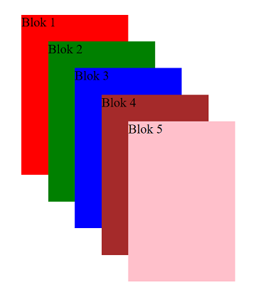
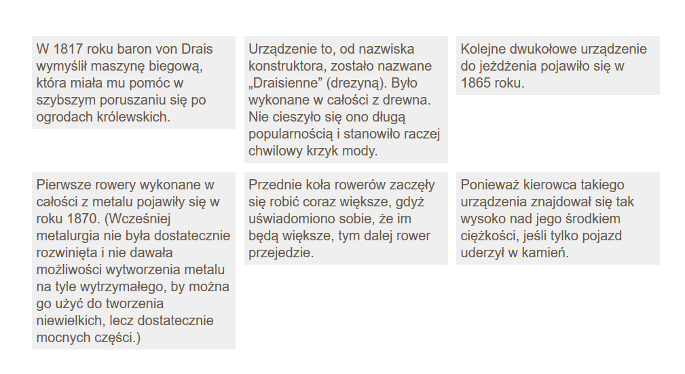
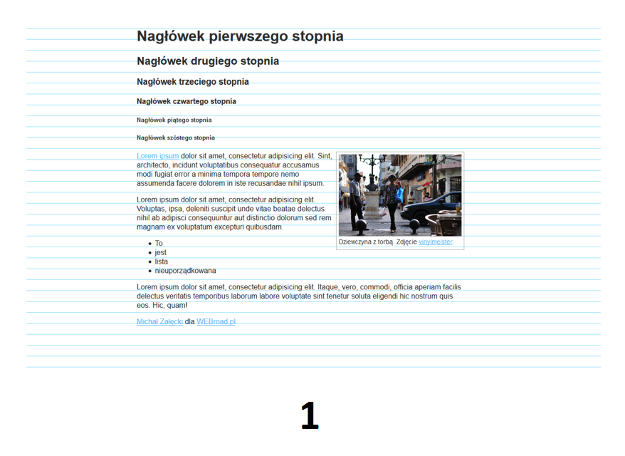
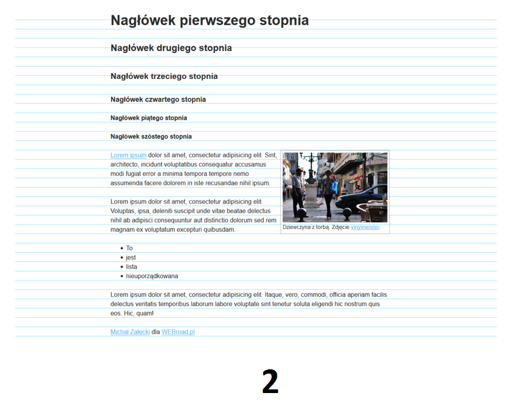
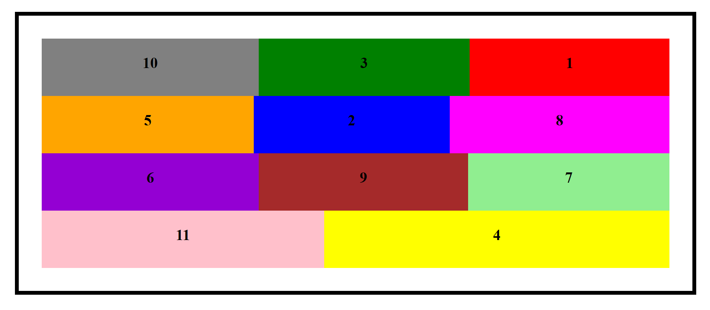

<div class="inner">
	<h1 id="main1">Zajęcia 3</h1>
    <div id="main2" class="h2">Materiały do&nbsp;warsztatów technologii webowych prowadzonych na Wydziale Matematyki i&nbsp;Informatyki Uniwersytetu im. Adama Mickiewicza w Poznaniu.</div>
	<a href="../../index.html" class="button-v button-module">Wróć do&nbsp;spisu materiałów</a>
	<a href="https://jsfiddle.net/" target="blank" class="button-v button-module">Tu będziemy testować kod&nbsp;źródłowy</a>
	<div style="clear: both;"></div>
</div>

## 5. Przypomnienie wiadomości o pozycjonowaniu elementów na&nbsp;stronie
Do pozycjonowania elementów na stronie służy właściwość <span class="preformat">position</span>.
Przyjmuje wartości:
- <span class="preformat">static</span> – rozkład normalny;
- <span class="preformat">relative</span> – umiejscawianie względne;
- <span class="preformat">absolute</span> – umiejscawianie bezwzględne;
- <span class="preformat">fixed</span> – umiejscawianie ustalone.

### 5.1. Rozkład normalny
W rozkładzie normalnym każdy element blokowy jest umieszczany poniżej poprzedniego. Jest to normalny sposób, w jaki przeglądarki traktują elementy HTML, nie musimy zaznaczać w CSS-ie, że elementy mają być tak rozmieszczane; można jednak to zrobić poprzez nadanie wartości <span class="preformat">static</span> właściwości <span class="preformat">position</span>.

### 5.2. Umiejscawianie względne
Umiejscawianie względne umożliwia przesuwanie elementów względem miejsca, w którym zostały umieszczone przy użyciu rozkładu normalnego.

### Przykład 5.1.

```css
body {
    width: 750px;
}

p {
    width: 450px;
}

p.example {
    position: relative;
    top: 10px;
    left: 100px;
}
```

### 5.2. Umiejscawianie bezwzględne
Domyślnie, element HTML, do którego zostanie dodana właściwość <span class="preformat">position: absolute;</span> nie pozostawia po sobie żadnej dodatkowej przestrzeni, dzięki czemu elementy, które go otaczały, nie reagują w żaden sposób na niego oraz na jego pozycję początkową.

Domyślnie, element wyświetlony z pozycji absolutnej będzie znajdował się w miejscu swojej pozycji początkowej, chyba że zmienimy to za pomocą właściwości CSS, które służą do ustalenia pozycji takiego elementu HTML, czyli za pomocą właściwości <span class="preformat">top</span>, <span class="preformat">right</span>, <span class="preformat">bottom</span> lub <span class="preformat">left</span>.

### Przykład 5.2.

```css
body {
    width: 750px;
}

h1 {
    position: absolute;
    top: 0px;
    left: 500px;
    width: 250px;
}

p {
    width: 450px;
}
```

### 5.3. Umiejscawianie ustalone
Umiejscawianie ustalone jest jednym z typów umiejscawiania bezwzględnego.
W przypadku tego sposobu umiejscawiania położenie elementu jest ustalone względem okna przeglądarki. Kiedy przewijamy zawartość strony, element pozostaje w tym samym miejscu.
Do określania miejsca w oknie przeglądarki, w którym zostanie umieszczony element, używane są poznane już właściwości przesunięcia.

### Przykład 5.3.

```css
body {
    width: 750px;
}

h1 {
    position: fixed;
    top: 0px;
    left: 0px;
    padding: 10px;
    margin: 0px;
    background-color: #efefef;
    width: 100%;
}

p.example {
    margin-top: 80px;
}
```

### 5.4. Właściwość <span class="preformat">z-index</span>
W przypadku stosowania umiejscawiania innego niż rozkład normalny pudełka elementów mogą na siebie nachodzić. Wówczas element, który jest umieszczony bliżej końca dokumentu HTML, jest wyświetlany powyżej elementów wcześniejszych.
Jeżeli zależy nam na kontroli wzajemnego przesłaniania różnych elementów, możemy to zrobić przy użyciu właściwości <span class="preformat">z-index</span>. Wartościami tej właściwości są liczby, a im większa będzie jej wartość, tym „wyżej” element zostanie umieszczony.
Właściwość <span class="preformat">z-index</span> jest także czasami nazywana kontekstem stosu, gdyż bloki elementów mogą tworzyć stos wzdłuż osi Z.

### Ćwiczenie 5.1.
Stosując właściwość <span class="preformat">z-index</span>, stwórz układ jak na poniższym obrazku:



Dodatkowo zmień swój kod źródłowy tak, aby trzeci blok był niezmiennie w tym samym miejscu okna przeglądarki (wrażenie przesuwania się elementu).

### 5.5. Opływanie elementów
Właściwość <span class="preformat">float</span> pozwala usunąć element z rozkładu normalnego strony i umieścić go możliwie jak najdalej na lewo lub prawo wewnątrz rodzica tego elementu.
Cała pozostała treść umieszczona wewnątrz takiego rodzica będzie otaczała ten pływający element.
W razie zastosowania właściwości <span class="preformat">float</span> należy także określić szerokość elementu pływającego. Jeżeli tego nie zrobimy, wyniki uzyskiwane w różnych przeglądarkach mogą być niespójne; w efekcie element pływający najprawdopodobniej zajmie całą szerokość elementu, w którym został umieszczony (czyli tak, jakby był rozmieszczony w normalny sposób).

W wielu układach stron ich poszczególne elementy są wyświetlane jeden obok drugiego. Bardzo często w celu uzyskania takiego efektu używa się elementów pływających. W przypadku ich zastosowania ich wysokość może mieć znaczący wpływ na miejsce, w którym element zostanie umieszczony.

Korzystając z właściwości <span class="preformat">clear</span>, możemy poinformować przeglądarkę, że żaden element (umieszczony wewnątrz tego samego rodzica) nie powinien się stykać z lewą/prawą krawędzią danego elementu. Właściwość ta przyjmuje wartości <span class="preformat">left</span>, <span class="preformat">right</span>, <span class="preformat">both</span> oraz <span class="preformat">none</span>.

### Ćwiczenie 5.2.
Stwórz układ jak na poniższym rysunku:



Kod źródłowy HTML:

```html
<!DOCTYPE html>
<html>
  <head>
    <meta http-equiv="content-type" content="text/html; charset=UTF-8">
  </head>
  <body>
    <p>W 1817 roku baron von Drais wymyślił maszynę biegową, która miała mu pomóc w szybszym poruszaniu się po ogrodach królewskich.</p>
    <p>Urządzenie to, od nazwiska konstruktora, zostało nazwane &#8222;Draisienne&#8221; (drezyną). Było wykonane w całości z drewna. Nie cieszyło się ono długą popularnością i stanowiło raczej chwilowy krzyk mody.</p>
    <p>Kolejne dwukołowe urządzenie do jeżdżenia pojawiło się w 1865 roku.</p>    
    <p>Pierwsze rowery wykonane w całości z metalu pojawiły się w roku 1870. (Wcześniej metalurgia nie była dostatecznie rozwinięta i nie dawała możliwości wytworzenia metalu na tyle wytrzymałego, by można go użyć do tworzenia niewielkich, lecz dostatecznie mocnych części.)</p>
    <p>Przednie koła rowerów zaczęły się robić coraz większe, gdyż uświadomiono sobie, że im będą większe, tym dalej rower przejedzie. </p>
    <p>Ponieważ kierowca takiego urządzenia znajdował się tak wysoko nad jego środkiem ciężkości, jeśli tylko pojazd uderzył w kamień.</p>    
  </body>
</html>
```

### Problem
Jeśli wewnątrz rodzica znajduje się jedynie element pływający, to niektóre przeglądarki uznają, że ma on zerową wysokość.

### Ćwiczenie 5.3.
Przypomnij sobie z zajęć o pozycjonowaniu z poprzedniego semestru jak można rozwiązać powyższy problem.

### Ćwiczenie 5.4.
Przeanalizuj powyższy problem na podstawie poniższego kodu źródłowego. Popraw ten kod tak, aby rozwiązać problem.

```html
<!DOCTYPE html>
<html>
  <head>
    <meta http-equiv="content-type" content="text/html; charset=UTF-8">
    <style type="text/css">
      body {
        width: 752px;
        font-family: Arial, Verdana, sans-serif;
        color: #665544;}
		
      div {
        border: 1px solid #665544;}
		
      p {
        width: 230px;
        float: left;
        margin: 10px;}
		
      .clear {
        clear: both;}
    </style>
  </head>
  <body>
    <h1>Ewolucja roweru</h1>
    <div>
      <p>W 1817 roku baron von Drais wymyślił maszynę biegową, która miała mu pomóc w szybszym poruszaniu się po ogrodach królewskich.</p>
      <p>Urządzenie to, od nazwiska konstruktora, zostało nazwane &#8222;Draisienne&#8221; (drezyną). Było wykonane w całości z drewna. Nie cieszyło się ono długą popularnością i stanowiło raczej chwilowy krzyk mody.</p>
      <p>Kolejne dwukołowe urządzenie do jeżdżenia pojawiło się w 1865 roku.</p>    
      <p class="clear">Pierwsze rowery wykonane w całości z metalu pojawiły się w roku 1870. (Wcześniej metalurgia nie była dostatecznie rozwinięta i nie dawała możliwości wytworzenia metalu na tyle wytrzymałego, by można go użyć do tworzenia niewielkich, lecz dostatecznie mocnych części.)</p>
      <p>Przednie koła rowerów zaczęły się robić coraz większe, gdyż uświadomiono sobie, że im będą większe, tym dalej rower przejedzie. </p>
      <p>Ponieważ kierowca takiego urządzenia znajdował się tak wysoko nad jego środkiem ciężkości, jeśli tylko pojazd uderzył w kamień.</p>    
    </div>
  </body>
</html>
```

## 6. Przypomnienie wiadomości o rytmie pionowym

### Ćwiczenie 6.1.
Która strona wygląda lepiej? Na obrazku nr 1 czy nr 2? Dlaczego?




(obrazy pobrano z <a href="http://webroad.pl/html5-css3/702-6-sass-compass-rytm-pionowy" target="blank">webroad.pl</a>)

**Rytm pionowy** jest to prawidłowość w ustaleniu rozmiaru odstępów, skutkująca uporządkowanym i&nbsp;przemyślanym rozmieszczeniem elementów witryny, głównie tekstu, w pionie.

Aby łatwiej ustawić rytm pionowy na stronie możemy skorzystać z narzędzia, które wstawia na stronie linie pomocnicze:
<a href="http://basehold.it/" target="blank">basehold.it</a>.

W wielkim skrócie, aby zachować rytm pionowy na stronie:

* rozmiary czcionek powinny być wielokrotnościami <span class="preformat">1rem</span> lub takimi wartościami, które są dzielnikami całkowitymi (w pikselach) rozmiaru czcionki w elemencie <span class="preformat">html</span> (wtedy warto użyć wartości <span class="preformat">calc()</span> dla&nbsp;właściwości <span class="preformat">font-size</span>; np. <span class="preformat">font-size: calc(2/3 * 1rem);</span>);
* wszystkie interlinie powinny być wielokrotnościami <span class="preformat">1rem</span>;
* każdy element powinien mieć wysokość (z uwzględnieniem dopełnień i marginesów) równą pewnej wielokrotności <span class="preformat">1rem</span>.

### Ciekawe artykuły (po angielsku) dotyczące rytmu pionowego:

* <a href="https://zellwk.com/blog/why-vertical-rhythms/" target="blank">Why is Vertical Rhythm an Important Typography Practice?</a>
* <a href="https://webdesign.tutsplus.com/articles/improving-layout-with-vertical-rhythm--webdesign-14070" target="blank">Improving Layout With Vertical Rhythm.</a>

## 7. Wprowadzenie do Flexboxa

### Trochę przydatnych informacji
Wejdź na stronę <a href="http://webroad.pl/html5-css3/2466-css3-flexbox-podstawowe-zalozenia" target="blank">CSS3 Flexbox – podstawowe założenia</a> i przeczytaj znajdujący się tam artykuł.

### Ciekawe strony:
* <a href="https://css-tricks.com/snippets/css/a-guide-to-flexbox/" target="blank">A Complete Guide to Flexbox</a> - teoria z przykładami;
* <a href="https://demo.agektmr.com/flexbox/" target="blank">CSS Flexbox Please!</a> - tu można sprawdzić jak działają poszczególne właściwości;
* <a href="http://flexboxfroggy.com/" target="blank">Flexbox Froggy</a> - ćwiczenia.

### Ćwiczenie 7.1.
Korzystając z mechanizmu flexbox, stwórz układ jak na poniższym obrazku na podstawie niżej podanego kodu źródłowego:



```html
<!DOCTYPE html>
<html>
	<head>
		<title>Ćwiczenie 7.1.</title>
	</head>
	<body>
		<div class="box">
			<div class="A">1</div>
			<div class="B">2</div>
			<div class="C">3</div>
			<div class="D">4</div>
			<div class="E">5</div>
			<div class="F">6</div>
			<div class="G">7</div>
			<div class="H">8</div>
			<div class="I">9</div>
			<div class="J">10</div>
			<div class="K">11</div>
		</div>
	</body>
</html>

```

## Zadania domowe

Na kolejne zajęcia musi być wykonana druga faza projektu - **zbudowanie szkieletu aplikacji w HTML5**.

Omówione dzisiaj zagadnienia będą używane w kolejnej fazie projektu. Więcej szczegółów będzie podane później.

### Źródła
* Duckett Jon, _HTML and CSS: Design and Build Websites_, przeł. Piotr Rajca, Helion, 2014, ISBN 978-83-246-6520-4.
* webkod.pl
* webroad.pl
